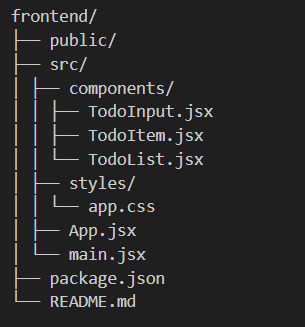

# 📝 To-Do List App (React)

A simple and responsive **To-Do List App** built using **React**. This project helps users stay organized by allowing them to add, delete, and mark tasks as complete.

<br>

() 

---

## 🚀 Features

- ✅ Add new tasks
- 🗑️ Delete tasks
- ✔️ Mark tasks as complete/incomplete (coming...)
- 💾 (Optional) Save tasks in localStorage (coming...)
- 🎨 Clean and minimal UI

---

## 📂 Project Structure


---

## 🛠️ Tech Stack

- ⚛️ **React**
- 🧠 **React Hooks** (`useState`)
- 💅 **CSS**

---

## 📦 Installation
Clone the repository

```bash
git clone https://github.com/Poushali-02/to-do-list.git
```

## Navigate into the project directory

```bash
cd to-do-list
```

## Install dependencies

```bash
npm install
```

## Run the server

```bash
npm start
```